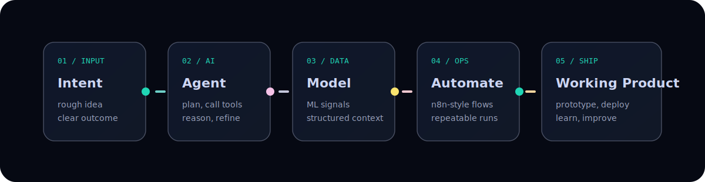

  

  

## Signal

I am Crescence Lobo, usually online as **Crs Lionel**. I build automation systems, AI-assisted workflows, and complete pipelines that move an idea from rough intent to working product.

My current center of gravity is **agentic AI, automation, applied ML, and workflow orchestration**. I like systems that feel clean under the hood and cinematic on the surface: useful logic, sharp UX, good motion, and just enough color to make the work memorable.

## Current Operating Mode

  

| Focus | What I am building toward |
| --- | --- |
| Agentic AI | Claude Code style workflows, tool-using agents, structured prompting, AI-assisted execution loops |
| Automation | n8n, Zapier-style orchestration, repeatable pipelines, ops glue, practical integrations |
| Applied ML | Supervised and unsupervised learning with scikit-learn, pandas, NumPy, Matplotlib, and Seaborn |
| Product engineering | Frontend basics, backend glue, scripting, deployment habits, and GCP/DevOps foundations |

## Stack

| Layer | Tools and languages |
| --- | --- |
| Languages | Python, JavaScript, HTML, CSS, C, C++, PowerShell |
| AI/ML | scikit-learn, pandas, NumPy, Matplotlib, Seaborn |
| Automation | n8n, Zapier, workflow design, pipeline thinking |
| Web | HTML/CSS/JS, API glue, product prototypes |
| Systems | Git, GitHub Actions, shell scripting, GCP fundamentals |

## Work In View

| Project | Shape |
| --- | --- |
| [KrishiDoot](https://github.com/Crs-Lionel/KrishiDoot) | JavaScript project and current main build surface |
| [personality-prediction-project](https://github.com/Crs-Lionel/personality-prediction-project) | Machine learning project using Random Forest for personality prediction |
| [NOSmvp1](https://github.com/Crs-Lionel/NOSmvp1) | Python MVP workspace for automation/product experimentation |
| [akaay-creatives-website](https://github.com/Crs-Lionel/akaay-creatives-website) | Creative web build with a design-forward direction |

## Activity

  
  

  <picture>
    <source media="(prefers-color-scheme: dark)" srcset="https://raw.githubusercontent.com/Crs-Lionel/Crs-Lionel/output/github-contribution-grid-snake-dark.svg" />
    <source media="(prefers-color-scheme: light)" srcset="https://raw.githubusercontent.com/Crs-Lionel/Crs-Lionel/output/github-contribution-grid-snake.svg" />
    
  </picture>

## Connect

  
  

  Design taste: automation logic, cinematic motion, sharp type, useful systems.

